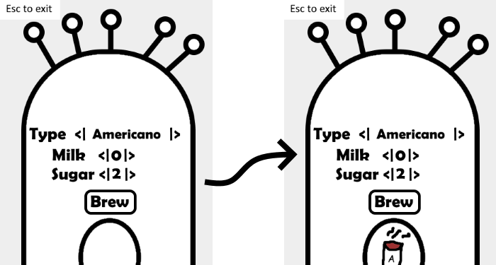
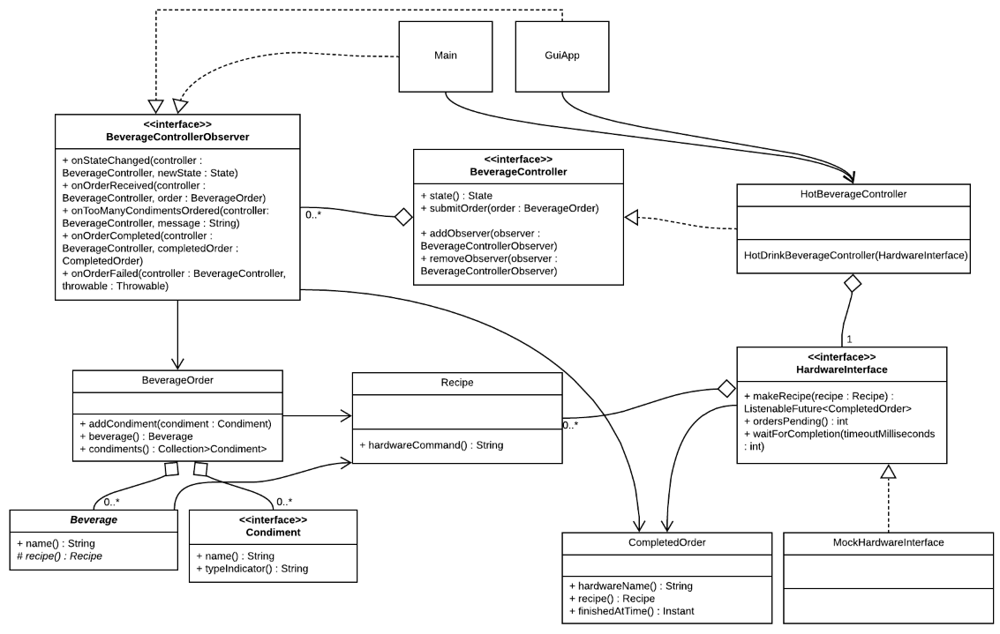

# Beverage Controller Example

  
  
Christopher D. Canfield  
BU MET CS 665 Group 5



## Overview


## Compiling & Running

Instructions on compiling and running the program using Apache Maven: 

### How to compile

```bash
mvn clean compile
```

### How to run the unit tests

```bash
mvn clean test
```

### How to run


Running the automated command line version:

```bash
mvn compile exec:java -Dexec.mainClass="edu.bu.met.cs665.Main" -Dlog4j.configuration="file:log4j.properties"
```

Running the GUI version:

```bash
mvn compile exec:java -Dexec.mainClass="edu.bu.met.cs665.gui.GuiApp" -Dlog4j.configuration="file:log4j.properties"
```

Esc exits the GUI version of the application.


## Design

### Assumptions

* 

### Design


### UML

**Core Classes, Interfaces, and Relationships**



### Design Patterns

**Observer**
* `BeverageControllerObserver <--> BeverageController`: Any class that implements the BeverageControllerObserver interface can subscribe to events that are issued by a BeverageController. Any BeverageControllerObserver can subscribe to any BeverageController (which currently only includes one concrete class: the HotBeverageController). In this implementation, the Main and GuiApp classes implement the BeverageControllerObserver interface, and subscribe to the HotBeverageController's events. Future classes that could benefit from this could include a console UI and a logging class.
* `GuiApp <--> JFrame`: In addition to implementing the BeverageController interface, GuiApp implements the MouseListener, KeyListener and MouseMotionListener observer interfaces, which allows it to receive events from a Swing JFrame. 
  
**Builder**  
**Factory: Beverage.recipe()**  
**Command**  
**Composite**   

### Notes

**Test Coverage**

As of July 25, 2019:  
* edu.bu.met.cs665.bev.controller: 99.1%
* edu.bu.met.cs665.bev.hardware: 99.1%

Main and the GUI are not currently covered by automated tests.

**Why wasn't Java Beans style naming used for getters (get*)?**  

getX(), getY() is perfectly fine. But it's not required. For an explanation, I'll refer you to Joshua Bloch, *Effective Java: Third Edition*, p. 291: 
> Methods that return a non-boolean function or attribute of the object on which they're invoked are usually named with a noun, a noun phrase, or a verb phrase beginning with the verb get, for example, `size`, `hashCode`, or `getTime`. There is a vocal contingent that claims that only the third form (beginning with get) is acceptable, but there is little basis for this claim. The first two forms usually lead to more readable code ...

**What are the flaws in this design and implementation?**

Beverage should probably be an interface. The Swing code is probably also not ideal, since I don't have much experience with Swing (RIP, JavaFX). Unlike the core program, which has unit tests that are approaching 100% code coverage according to EclEmma, the GUI has no automated tests, and has only been manually tested. There are probably a few design inconsistencies that should be reconciled. These are issues to address in a future release.


