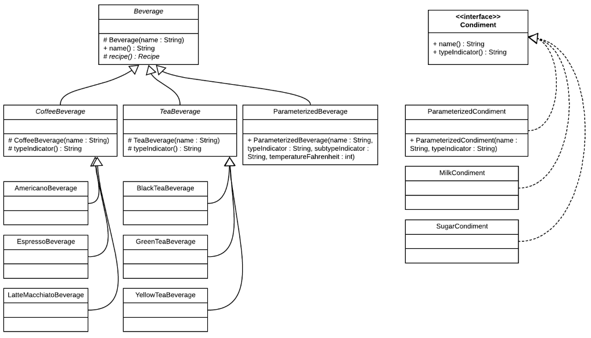

# Beverage Controller Example

  
  
Christopher D. Canfield  
BU MET CS 665 Group 5


## Overview

We have a seen a number of excellent, small-scale examples so far in this course. That is a great way to learn the patterns, because small-scale examples allow us to more easily focus on the design, and not get lost in irrelevant details.

However, most useful programs are not small. Additionally, patterns are rarely used alone: typically, a medium-scale or larger program will use many of the design patterns that we have discussed, or will discuss in the later modules. A larger program also presents more opportunities to show the design principles that we have discussed, such as ensuring that our design is flexible, understandable, robust & reliable, and so forth. (See the module 1 section titled "Goals of Software Design" for more design goals that we work to achieve in our software.)

For those reasons, I decided to take our assignment 1 specification, and create a program that is at a larger scale than what we have seen so far. I have incorporated a number of [design patterns](#Design-Patterns) that we have seen, or will soon see, as well as a few that we will only briefly touch on. 
 

## Compiling & Running

Instructions on compiling and running the program using Apache Maven: 

### How to compile

```bash
mvn clean compile
```

### How to run the unit tests

```bash
mvn clean test
```

### How to run

Running the automated command line version:

```bash
mvn compile exec:java -Dexec.mainClass="edu.bu.met.cs665.Main" -Dlog4j.configuration="file:log4j.properties"
```

Running the GUI version:

```bash
mvn compile exec:java -Dexec.mainClass="edu.bu.met.cs665.gui.GuiApp" -Dlog4j.configuration="file:log4j.properties"
```

Esc exits the GUI version of the application.


## Design

### Assumptions

Most of the assumptions were derived from the requirements document.  

* The beverage vending machine can initially brew six hot drinks, including three types of coffee and three types of tea: Americano, Espresso, Latte Macchiato, Black Tea, Gree Tea, and Yellow Tea.
* A drink order can contain up to three milks and three sugars. If the drink order sent to the controller exceeds these maximums -- such as if the user interface doesn't correctly limit them -- the controller will automatically update the order and notify any observers.
* New beverage and condiment types may be added in the future. These may be added directly in code (in this design, they would extend Beverage, CoffeeBeverage, TeaBeverage, or Condiment), or they could be loaded from a data source, such as a text file, a database, or from a web service (in that case, they would be instantiated using ParameterizedBeverage or ParameterizedCondiment).
* The controller may be used with multiple user interfaces, such as touch screen, phone app, and command line UIs.
* We would like the ability to use the same user interfaces with other controllers, such as a controller that makes only cold drinks.
* After processing the request, the controller sends the recipe to the hardware, which is represented here as the "HardwareInterface" (called "Interface" because it interfaces directly with the hardware, not because it is implemented as a Java interface in the system). The recipe is converted into a hardware instruction, which is what the hardware ultimately uses to create the drink.
* The controller won't block the user interface: user interfaces can continue to submit orders as the current orders are being processed. Orders are completed in first-in-first-out order.


### UML

**Core Classes, Interfaces, and Relationships**


___
**Beverages & Condiments**

 

### Design Patterns

**Observer**
> Define a one-to-many dependency between objects so that when one object changes state, all its dependents are notified and updated automatically. [GoF, *Design Patterns*, p. 293]

* `BeverageControllerObserver <--> BeverageController`: Any class that implements the BeverageControllerObserver interface can subscribe to events that are issued by a BeverageController. Any BeverageControllerObserver can subscribe to any BeverageController (which currently only includes one concrete class: the HotBeverageController). In this implementation, the Main and GuiApp classes implement the BeverageControllerObserver interface, and subscribe to the HotBeverageController's events. Future classes that could benefit from this could include a console UI and a logging class.  
This implementation uses the push model. That somewhat increases coupling, but at the benefit of providing more detailed information to the observers.
* `GuiApp <--> JFrame`: In addition to implementing the BeverageController interface, GuiApp implements the MouseListener, KeyListener and MouseMotionListener observer interfaces, which allows it to receive events from a Swing JFrame. 
  
**Builder**  
> Separate the construction of a complex object from its representation so that the same construction process can create different representations. [GoF, *Design Patterns*, p. 97]

* `Spinner`: The spinner has a left and right arrow on either side, and in the middle contains an image representing the current value. It is a generic type, and can be used to represent any Java type, including Integers and Beverages. Its flexibility makes its creation somewhat complex, however. For that reason, the Builder pattern was used to make the creation process clearer. Example, from the GuiApp class:

```java
beverageSpinner = new Spinner.Builder<Beverage>()
    .setResourceManager(resourceManager)
    .setUpButtonRect(new Rectangle(312, 235, 31, 34))
    .setDownButtonRect(new Rectangle(178, 235, 31, 34))
    .setItemPosition(new Point(163, 238))
    .addItem(new AmericanoBeverage(), ImageId.TEXT_AMERICANO)
    .addItem(new EspressoBeverage(), ImageId.TEXT_ESPRESSO)
    .addItem(new LatteMacchiatoBeverage(), ImageId.TEXT_LATTE_MACCHIATO)
    .addItem(new BlackTeaBeverage(), ImageId.TEXT_BLACK_TEA)
    .addItem(new GreenTeaBeverage(), ImageId.TEXT_GREEN_TEA)
    .addItem(new YellowTeaBeverage(), ImageId.TEXT_YELLOW_TEA)
    .build();
```

* `Recipe`: Recipe uses the Builder pattern in order to introduce named parameters, and to fully separate its creation from its representation. It's useful since Recipe is immutable, like many of the classes in this program, and so it provides additional flexibility during the creation process that may be more difficult when using only constructors.  

**Composite**
> Compose objects into tree structures to represent part-whole hierarchies. Composite lets clients treat individual objects and compositions of objects uniformly. [GoF, *Design Patterns*, p 168]

**Prototype**
> Specify the kinds of objects to create using a prototypical instance, and create new objects by copying this prototype. [GoF, *Design Patterns*, p. 117]

**Factory: Beverage.recipe()**  
> 

**Command**
> 
  
   

### Notes

**Test Coverage**

As of July 25, 2019:  
* edu.bu.met.cs665.bev.controller: 99.1%
* edu.bu.met.cs665.bev.hardware: 99.1%

Main and the GUI are not currently covered by automated tests.

**Why wasn't Java Beans style naming used for getters (get*)?**  

getX(), getY() is perfectly fine. But it's not required. For an explanation, I'll refer you to Joshua Bloch, *Effective Java: Third Edition*, p. 291: 
> Methods that return a non-boolean function or attribute of the object on which they're invoked are usually named with a noun, a noun phrase, or a verb phrase beginning with the verb get, for example, `size`, `hashCode`, or `getTime`. There is a vocal contingent that claims that only the third form (beginning with get) is acceptable, but there is little basis for this claim. The first two forms usually lead to more readable code ...

**What are the flaws in this design and implementation?**

Beverage should probably be an interface. The Swing code is probably also not ideal, since I don't have much experience with Swing (RIP, JavaFX). Unlike the core program, which has unit tests that are approaching 100% code coverage according to EclEmma, the GUI has no automated tests, and has only been manually tested. There are probably a few design inconsistencies that should be reconciled. These are issues to address in a future release.


